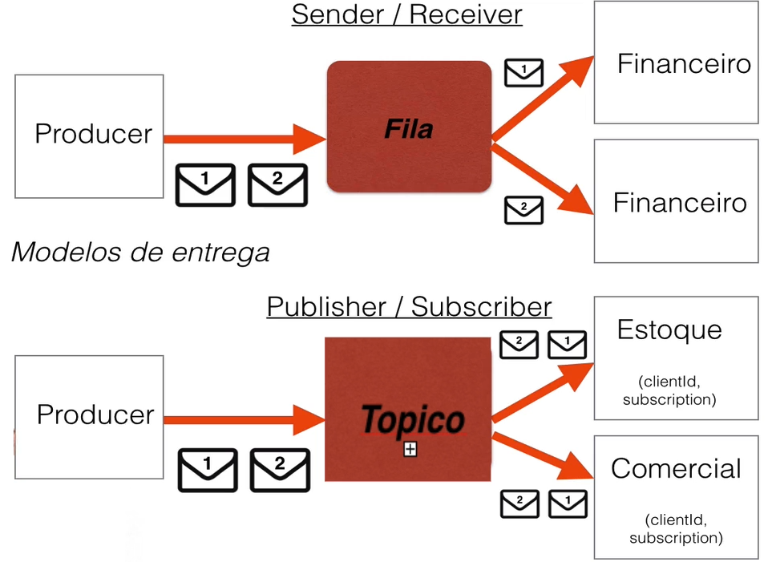

## activemq-integration
##### Integração entre api's com ActiveMQ e JMS
[Lista de MOM(Message Oriented Middleware)](https://en.wikipedia.org/wiki/Message_broker)
##### EAI (Enterprise Application Integration) os 4 Estilos de Integração:
    1. File Transfer
    2. Shared Database
    3. Remote Procedure Invocation
    4. Messaging

    

###### 1. [Download ActiveMQ](https://activemq.apache.org/components/classic/download/)
###### 2. Descompactar o zip, entrar na pasta bin e executar o ActvieMQ
    sh activemq console 
###### 3. ActiveMQ WebConsole
    http://0.0.0.0:8161/
###### 4. ActiveMQ Jolokia REST API 
    http://0.0.0.0:8161/api/jolokia/
###### 5. Criar o consumidor e criador das mensagens
	https://activemq.apache.org/jndi-support.html
###### 6. Criar os tópicos

###### 7. Seletor dentro do tópico
    https://activemq.apache.org/selectors.html
    
	*Producer*

	public void runTopiSelector(String msg, boolean ativo) {
		jmsTemplate.convertAndSend(new ActiveMQTopic(topic), msg, messagePostProcessor -> {
			messagePostProcessor.setBooleanProperty("item", ativo); //define o atrivo e o valor que o consumidor deve filtrar
			return messagePostProcessor;
		});
	}

	*Consumer*

	@JmsListener(id = "primeiroTopicoId",
                 destination = "${topic.primeiroTopico}",
                 containerFactory = "jmsFactoryTopic",
                 subscription = "primeiroTopico",
                 selector = "item is null OR item=true")
    public void onReceiverTopic(String str) {
        System.out.println(str);
    }
